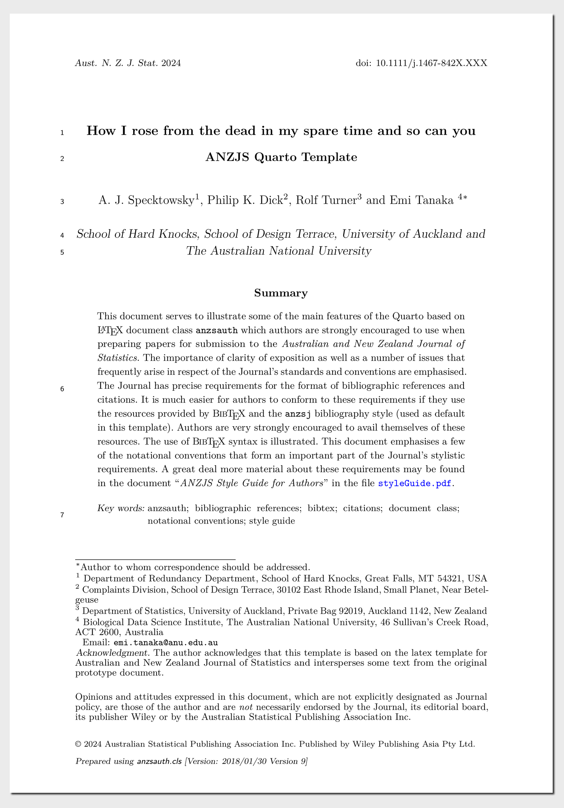

<!-- README.md is generated from README.qmd. Please edit that file -->

This is an unofficial [Quarto](https://quarto.org/) template for the
*Australian and New Zealand Journal of Statistics* based on their LaTeX
template in the [Author
Guidelines](https://onlinelibrary.wiley.com/page/journal/1467842x/homepage/forauthors.html).
The original zip file that contains the style guide and latex template
is available
[here](https://onlinelibrary.wiley.com/pb-assets/assets/1467842X/anzsauth-1545395150170.zip).

## Getting started

First install [Quarto](https://quarto.org/docs/get-started/). To use
Quarto, see the [Quarto website](https://quarto.org/) for more
information.

From the Terminal run the command below. This will install the extension
and create an example qmd file that you can use as a starting place for
your paper.

``` bash
quarto use template emitanaka/quarto-anzjs@master
```

Or if you just to add the template to your current project, you can use
the following command:

``` bash
quarto add emitanaka/quarto-anzjs@master
```

[](examples/template.pdf)

## ANZJS Style Guide

Be sure to read the [ANZJS Style Guide](styleGuide.pdf) for more
information on how to format your paper. Always check the [Author
Guidelines](https://onlinelibrary.wiley.com/page/journal/1467842x/homepage/forauthors.html)
on the ANZJS website for the latest information.
